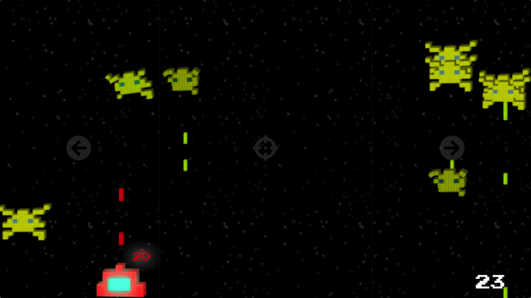
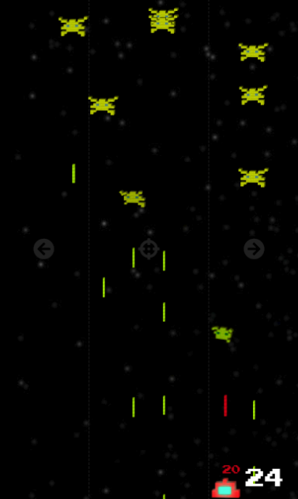
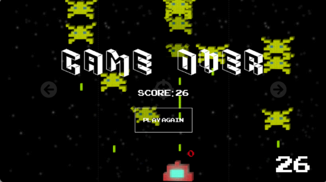

### Introduction

I have made this shoot them all game to practice my skills in Angular during my free time. I designed it from scatch, from the code to the design of pictures. It is playable on mobile, tablet and desktop. 

You can directly play online [:arrow_forward: here](https://invader-2437c.web.app/game)

To play :
- On mobile : press the right of left side of the touchscreen to move, and the center to fire
- On dekstop : use the arrow keys to move, and the up/space key to fire

#### Screenshots

Desktop version :

Mobile version :

Game Over :

 

**Note** : I had previously done another version in Python. You can check its repo [here](https://github.com/CharlieBrugvin/shoot-them-all).